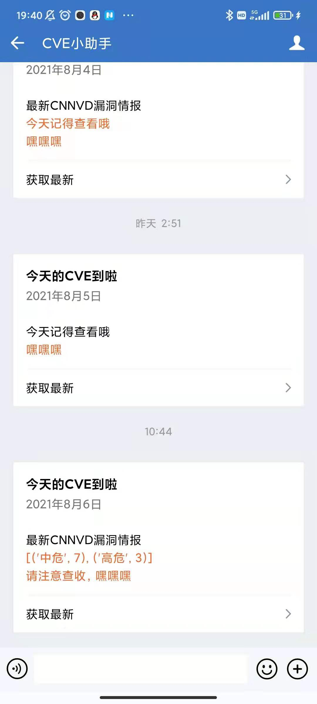
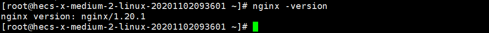
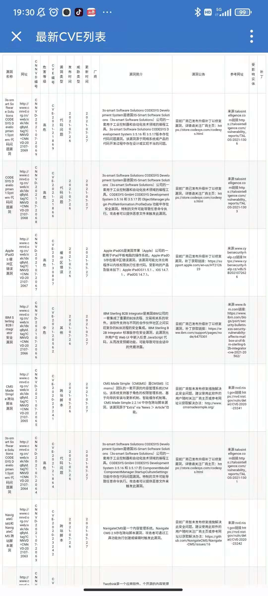

# Cnnvd_monitor

## 更新

### 功能添加：

添加统计漏洞信息级别功能，七天统计一次，会在周五推送，并会显示在推送的消息卡片上。效果如下：



### BUG修复

修复因为token过期导致的微信卡片消息推送失败问题。

## CNNVD漏洞信息监控脚本

基于Python爬虫的CNNVD漏洞信息监控脚本——Cnnvd_monitor，实现了对CNNVD官网平台的实时监控、数据获取、入库、并用微信进行实时推送、并将获取的数据进行Web端表格展示。

感谢嘉隆师傅对代码进行完善修改。撒花。

每五个小时检测一次，网站是否更新。

## 使用说明

### 前期准备

- 开发语言：python3

- 一台服务器(脚本跑在服务器上)

- 一个域名(可选)

首先进行数据库初始化，初始化时生成log文件夹用来存放生成的日志文件。命令如下：

```
python3 installDb.py
```

### 环境搭建

因为要做Web端表格展示，所以这里**使用Nginx做了目录浏览**。服务器系统使用的是CentOS7，过程如下。

首先使用yum源下载nginx，命令如下：

```
yum install -y nginx
```

装好后，查看版本，检查是否安装成功，如下图：



然后找到nginx的配置文件，具体位置为：

```
cd /etc/nginx/
```

找到nginx.conf文件，对其中的server板块进行修改就可以了，**主要是添加了末尾三行**。

    server {
        listen       80;
        listen       [::]:80;
        server_name  _;
       # root         /usr/share/nginx/html;
        charset utf-8;
        # Load configuration files for the default server block.
        include /etc/nginx/default.d/*.conf;
        location / {
                root /usr/share/nginx/html/download;
        autoindex on; #开启索引功能
        autoindex_exact_size off; #关闭计算文件确切大小(bytes)
        autoindex_localtime on; #显示本机时间
    }

注意生成文件位置，我这里是`/usr/share/nginx/html/download` ，看个人爱好。

### 配置企业微信推送

这个需要先到企业微信创建一个企业，并自建一个应用，**获取到自定义应用的 Secret和注册的企业 corpid**，就可以了。修改位置在**Cnnvd_moniter.py文件的161行至165行**

启动监控脚本，命令如下：

```
python3 Cnnvd_moniter.py
```

## 效果展示


点击卡片会跳转到Web表单展示页面，如下：



## 参考文章

https://blog.csdn.net/weixin_43345082/article/details/96475950

https://github.com/yhy0/github-cve-monitor

https://cloud.tencent.com/developer/article/1621016

**搜索引擎（debug）**